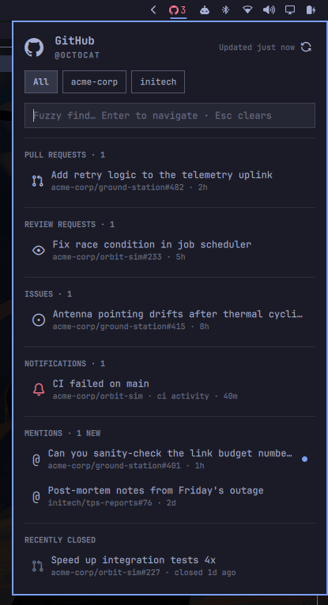

# GitHub Inbox for Omarchy

Your GitHub inbox in the [Omarchy](https://omarchy.org) bar: one chip with
your open workload count, one panel with everything on your plate. Every row
is one click (or one keystroke) away from its page on GitHub.



## Sections

- **Notifications**: your unread GitHub notifications, minus anything another
  section already represents; clicking a row dismisses it here *and* marks the
  thread read on GitHub
- **Pull requests**: open PRs you authored or are assigned to (drafts dimmed)
- **Review requests**: open PRs where your review was requested
- **Issues**: open issues assigned to you
- **Mentions**: the last 30 open threads you were mentioned in, with an
  unread dot that only lights up when *someone else* acts (your own comments
  and reactions never re-mark a thread) and clears when you open it
- **Recently closed**: the 5 most recent closures (last 30 days) among your
  PRs, assigned issues, and mention threads, per org tab

The bar chip shows the octocat plus your open PR + review + issue count, and
switches to the urgent color while unread notifications or mentions wait.

## Interactions

| Input | Action |
|---|---|
| Left-click chip | Toggle the panel |
| Middle-click chip | Refresh |
| Right-click chip | Open github.com/notifications |
| `j`/`k` or ↓/↑ | Move the row cursor |
| `h`/`l` or ←/→ | Switch organization filter |
| `[` / `]` | Jump between sections |
| `Enter` | Open the selected row in the browser |
| `/` | Fuzzy find (neovim-style subsequence match on titles, repos, and section names, scoped to the active org filter); `Enter` accepts the filter and returns to navigation, `Esc` clears |
| `r` | Refresh |

IPC works from anywhere, always targeting the focused monitor's instance:

```bash
omarchy-shell viniciusfnery.github-inbox toggle   # or: open, close, refresh
omarchy-shell viniciusfnery.github-inbox find     # open with fuzzy find focused
```

A keybinding, in `~/.config/hypr/bindings.lua`:

```lua
o.bind("SUPER + CTRL + G", "GitHub Inbox", "omarchy-shell viniciusfnery.github-inbox find")
```

## Install

Requires the [GitHub CLI](https://cli.github.com) (`gh`) and `jq`
(preinstalled on Omarchy):

```bash
omarchy pkg add github-cli   # if gh is missing
omarchy plugin add https://github.com/viniciusfnery/omarchy-github-inbox.git --enable
```

## Authentication

The plugin rides the GitHub CLI's login. It never sees or stores a token
itself. Sign in once:

```bash
gh auth login
```

Pick **GitHub.com → HTTPS → Login with a web browser** and follow the device
prompt; the token lands in your system keyring. Verify with `gh auth status`.
The default scopes gh requests (`repo`, `read:org`) cover everything the
plugin reads, including the notifications API. Until you sign in (or whenever
the token expires), the panel shows a "Not signed in: run gh auth login" card
instead of silently going empty, and recovers on its own within
30 seconds of you logging in.

## Settings

Settings live in the widget's entry in `~/.config/omarchy/shell.json`. Edit
that file directly (it hot-reloads on save), or set values from the terminal:

```bash
omarchy bar set viniciusfnery.github-inbox refreshIntervalSec 600 --json
omarchy bar set viniciusfnery.github-inbox mentionLimit 50 --json
```

(`--json` keeps numbers as numbers.) They also appear in the Omarchy
settings UI under the bar widget's options.

| Key | Default | What it does |
|---|---|---|
| `refreshIntervalSec` | `300` | How often the GitHub data refreshes (min 60) |
| `mentionLimit` | `30` | How many open mention threads to track |
| `closedDays` | `30` | How far back "recently closed" looks |
| `closedLimit` | `5` | Closed rows shown per org tab |

## Uninstall

```bash
omarchy plugin remove viniciusfnery.github-inbox
```

That unloads the widget from the bar and deletes the plugin. It runs no
background services, so nothing else keeps running. For a full scrub, two
small data files remain to delete, and your keybinding if you added one:

```bash
rm -f ~/.cache/omarchy-github-tasks.json \
      ~/.local/state/omarchy/github-mentions-seen.json
```

The plugin never touches your GitHub credentials; those belong to the
`gh` CLI (`gh auth logout` if you want them gone too).

## Development

`fetch.sh` (the data collector) is covered by a token-free test suite that
runs it against a fake `gh` serving fixtures, including regression tests for
rate-limit garbage on stdout, oversized payloads, and cache poisoning:

```bash
tests/run.sh
```

CI runs the suite plus shellcheck and a manifest sanity check on every push.

## Notes on behavior

- Auth rides the `gh` CLI's login; a signed-out or offline state shows an
  error card while the last good data stays visible, retrying every 30s.
- Results are cached for 60s (`~/.cache/omarchy-github-tasks.json`) so
  multi-monitor bars share one API burst; a cold refresh makes ~8 requests,
  well inside GitHub's rate limits.
- Mention read-state is local (`~/.local/state/omarchy/github-mentions-seen.json`);
  after suspend/resume the panel detects the time jump and refreshes within a
  minute.
- Lists cap at the 50 most recently updated per section (mentions 30, closed
  20 per type / last 30 days).
- Rows only ever open `https://github.com/` URLs; GitHub Enterprise hosts are
  not supported.

## License

MIT
